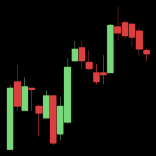
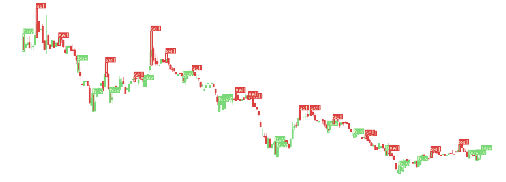
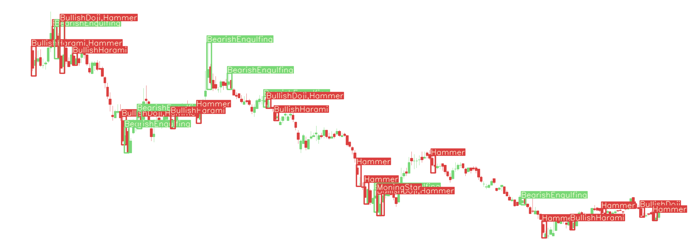
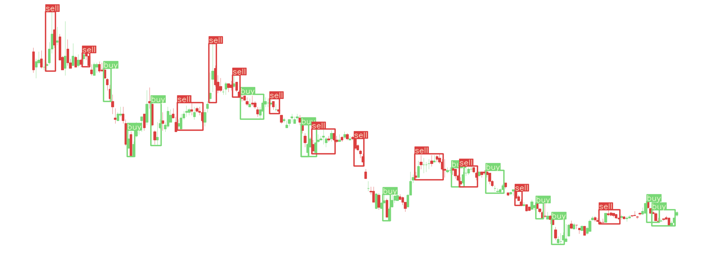

# Data

Before training CNN and Yolov7 models, you must make dataset.

## 1. Installation
Install packages with:
```
pip install -r requirements.txt
```

## 2. Quick Start
Preprocess all progress at one command

Before start, **modify variables** in bash file

```
nohup bash preprocess.bash > preprocess.txt &
```

## 3. Module
### 3.1 Download Stock OHLCV historical data
download stock historical data using [FinanceDataReader](https://github.com/financedata-org/FinanceDataReader)

```
# download all stock historical data of both kospi and kosdaq markets
python make_stocks.py -m kospi kosdaq
```

__Download Directory__

```
Data
└── Stock
    ├── Kosdaq
    │   ├── 000250.csv
    │   └── ...
    └── Kospi
        ├── 000020.csv
        └── ...
```

### 3.2 Make Candlestick Chart
make candlestick chart from stock historical data

</img><br/>

__Select market, base style, and the number of tickers__
```
# make candlestick chart of both kospi and kosdaq markets in Yolo folder based on yolo default setting
python make_candlesticks -n Yolo -m kospi kosdaq --yolo

# make candlestick chart of only kospi market in CNN folder based on cnn default setting
python make_candlesticks -n CNN -m kospi --cnn

# make only 50 tickers
python make_candlesticks -n Yolo -m kospi kosdaq --yolo -num 50
```

__Add Feature__
```
# with volume
python make_candlesticks -n CNN -m kospi kosdaq --cnn -v

# with Simple Moving Average (period 10 and 20)
python make_candlesticks -n CNN -m kospi kosdaq --cnn -sma 10 20

# with Exponential Moving Average (period 60 and 120)
python make_candlesticks -n CNN -m kospi kosdaq --cnn -ema 60 120

# with Moving Average Convergence & Divergence (short period 12, long period 26, signal period 9)
python make_candlesticks -n CNN -m kospi kosdaq --cnn -macd 12 26 9
```

__Adjust chart setting__
```
# trading period 250, image size 1600 × 500
python make_candlesticks -n Yolo -m kospi kosdaq --yolo --period 250 --size 1600 500
```

__Directory__

```
Data
└── Image
    └── {name}
        └── Kospi
            ├── images
            │   ├── 000020_2022-12-01.png
            │   └── ...
            └── pixels
                ├── 000020_2022-12-01.csv
                └── ...
```
Image file name: {ticker}_{last date of candlestick chart}.png

pixels: there are csv files mapping *__trade date__* to *__pixel coordinates__*.

### 3.3 Update
update stock hitorical data and candlestick chart everyday

First, set markets and candlestick chart folder names in _update.bash_
```
market=("kospi" "kosdaq")
names=("224x224" "1800x650")
```

run update.bash via cron
```
# execute "crontab -e" and add this line. Write absolute path of update.bash
0 0 * * * /home/user/Data/update.bash
```

### 3.4 Labeling

#### 3.4.1 CNN Labeling
```
# n%_01_2 Labeling, n = 4
python make_labeling.py --cnn -m kospi kosdaq --method 4%_01_2
```

#### 3.4.2 Yolo Labeling

```
# MinMax Labeling
python make_labeling.py --yolo -m kospi --method MinMax
```

</img><br/>

```
# Pattern Labeling
python make_labeling.py --yolo -m kospi --method Pattern
```
</img><br/>


```
# Merge Labeling
python make_labeling.py --yolo -m kospi --method Merge

```
</img><br/>

__Directory__
```
Data
└── Labeling
    ├── CNN
    │   ├── Kosdaq
    │   │   ├── 4%_01_2
    │   │   │   ├── labeling_20_5.csv
    │   │   │   └── ...
    │   │   └── ...
    │   └── Kospi
    │       ├── 4%_01_2
    │       │   ├── labeling_20_5.csv
    │       │   └── ...
    │       └── ...
    └── Yolo
        ├── Kosdaq
        │   ├── MinMax
        │   │   ├── 000250_2022-12-01_245.csv
        │   │   └── ...
        │   └── ...
        └── Kospi
            ├── MinMax
            │   ├── 000020_2022-12-01_245.csv
            │   └── ...
            └── ...
```


### 3.5 Make Dataset

```
# make dataset based on cnn default setting
# with labeling method '4%_01_2' and Image folder name '224x224'
python make_dataset.py --cnn -m kospi kosdaq -l 4%_01_2 -i 224x224

# make dataset based on cnn default setting
# with labeling method 'Merge' and Image folder name '1800x650'
python make_dataset.py --yolo -m kospi kosdaq -l Merge -i 1800x650
```


__Directory__
```
Data
└── Dataset
    ├── CNN
    │   └── {name}
    │       ├── train
    │       │   ├── 0
    │       │   └── 1
    │       ├── valid
    │       │   ├── 0
    │       │   └── 1
    │       ├── test{year}
    │       │   ├── 0
    │       │   └── 1
    │       └── ...
    └── Yolo
        └── {name}
            ├── images
            │   ├── train
            │   ├── valid
            │   ├── test{year}
            │   └── ...
            ├── labels
            │   ├── train
            │   ├── valid
            │   ├── test{year}
            │   └── ...
            └── dataframes
                ├── train
                ├── valid
                ├── test{year}
                └── ...
```


## 4. Reference

> Martinssson, F., & Liljeqvist, I. (2017). Short-Term Stock Market Prediction Based on Candlestick Pattern Analysis.